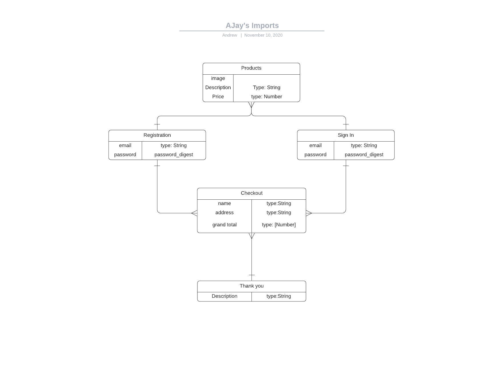

# AJay's Imports

#### November 9, 2020

 ##### By: Andrew Cruz

***

## User Guideline

The user will be able to log onto the website and get a list of auto parts for their vehicle. On the page they will see a display with the product, price, and a button where they can add that automotive part to their cart. When the user is ready to checkout they will click a icon on the top right of their page and it will direct them to a registration page, which will ask for username (email) and create a password. Once registered they will see a grand total of their order and will be asked to input an address and credit/debit card information. After successfully processing the order they will see a final Thank you page.
***

## Technologies

* TBD
***

## AJay's Imports ERD

